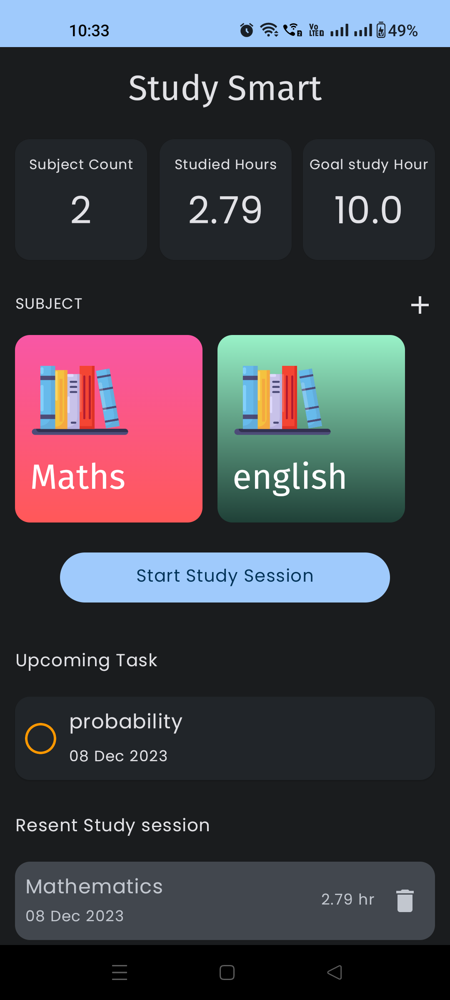
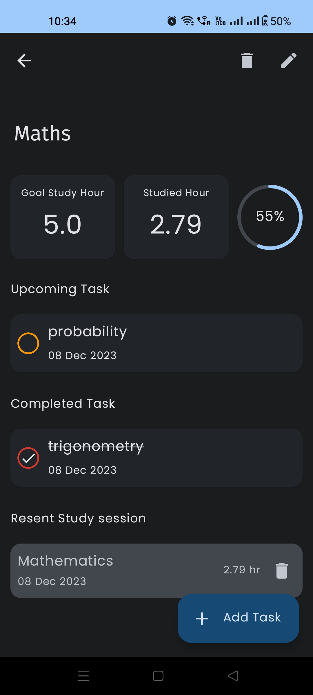
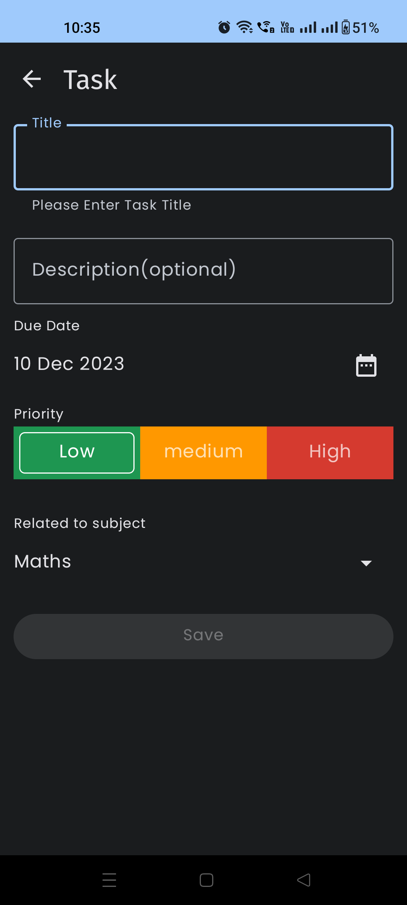
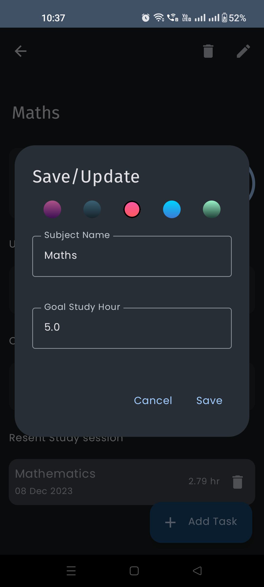
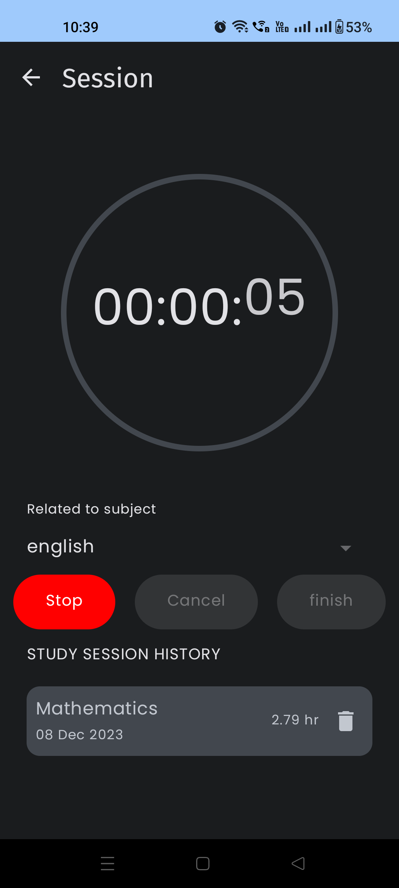

# StudySmart

## ScreenShort
|  |  |   |
| :---:                              | :---:                             | :---:                              |
|   |  |   |
|   |  |   |

## "The app offers the  following Packages:"

- Room database (https://developer.android.com/training/data-storage/room)
  
- Navigation -> destination library (https://github.com/raamcosta/compose-destinations)

- Application services (https://developer.android.com/guide/components/services)

- Notification builder (https://developer.android.com/reference/android/app/Notification.Builder)
  
- Dependency injection (https://developer.android.com/training/dependency-injection/hilt-android)

- MVVM architecture
  
- Using State Flow (https://developer.android.com/kotlin/flow)

## TODO

- Add Testing

- Implement new features into it
